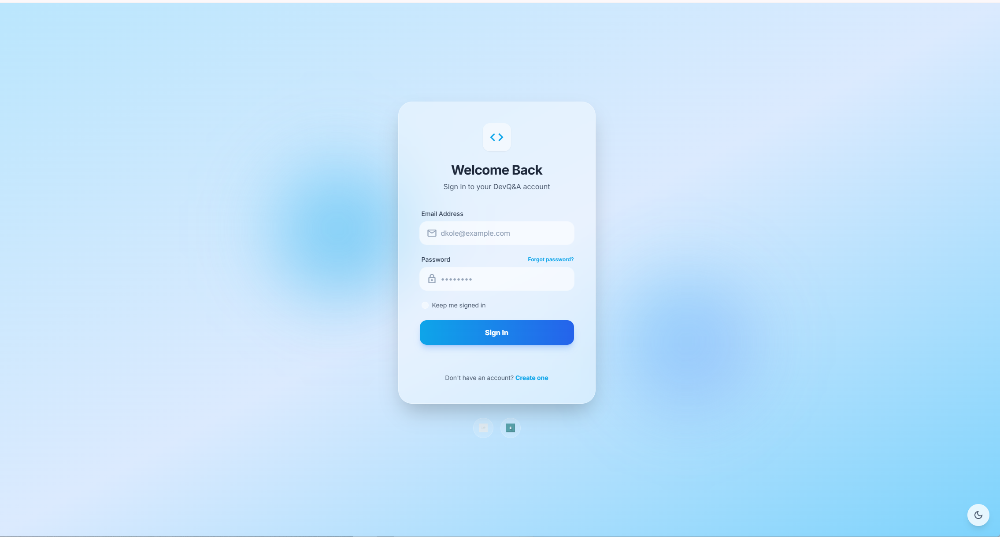
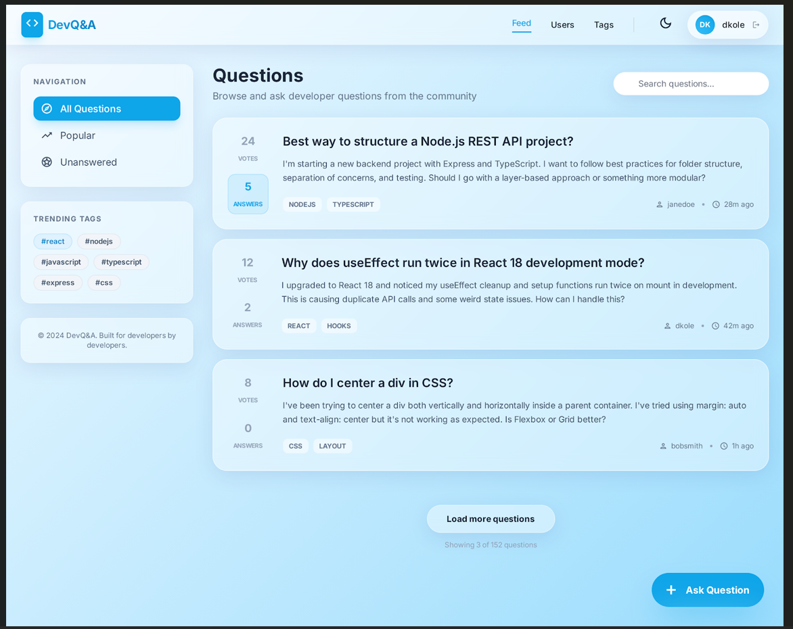
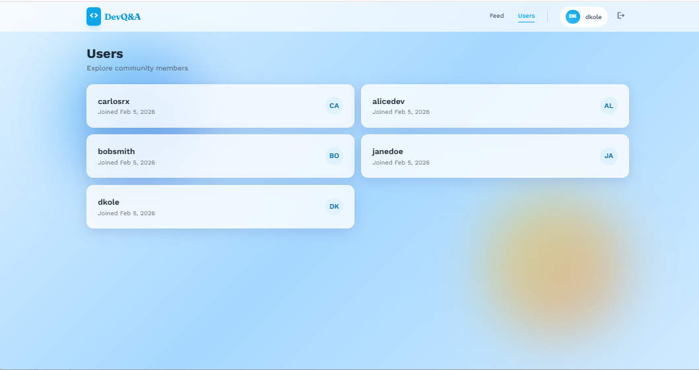

# DevQ&A Platform

A full-stack developer Q&A platform built with React, Express, PostgreSQL, and TypeScript. Developers can post coding questions, write answers, and vote on the most helpful responses. Think of it as a focused, self-hosted Stack Overflow for your team.

---

## Screenshots

### Login



### Questions Feed



### Users



---

## Tech Stack

| Layer | Technology |
|-------|------------|
| Frontend | React 18, TypeScript, Vite, Tailwind CSS, shadcn/ui, React Router 6, Axios |
| Backend | Express 4, TypeScript, Sequelize 6 ORM, JWT + bcrypt |
| Database | PostgreSQL |
| Testing | Vitest, Supertest, Testing Library, MSW (Mock Service Worker) |
| Tooling | concurrently, ts-node-dev, PostCSS, ESLint |

---

## Project Structure

```
devQnA-week3/
  package.json              # Root scripts (start:dev, test, build)
  start-dev.js              # Windows-safe concurrent server + client launcher
  docs/screenshots/         # Application screenshots
  client/                   # React frontend
    src/
      pages/                # Login, Register, Questions, QuestionDetail, AskQuestion, Users
      components/           # Layout, ProtectedRoute, shadcn/ui components
      context/              # AuthContext (JWT state management)
      services/             # Axios API client with interceptors
      types/                # Shared TypeScript interfaces
    tests/                  # Frontend unit tests (Vitest + MSW)
  server/                   # Express backend
    src/
      routes/               # auth, questions, answers, votes, users
      models/               # User, Question, Answer, Vote (Sequelize)
      middleware/            # JWT authentication middleware
      config/               # Database connection + sync logic
    scripts/                # Database seed script
    tests/                  # Backend integration tests (Vitest + Supertest)
```

---

## Prerequisites

- **Node.js** 18 or higher
- **PostgreSQL** 14 or higher
- **npm** 9 or higher

---

## Getting Started

### 1. Clone the repository

```bash
git clone https://github.com/louverture-t/devQnA-week3.git
cd devQnA-week3
```

### 2. Install root dependencies

```bash
npm install
```

### 3. Install backend dependencies

```bash
npm install --prefix server
```

### 4. Install frontend dependencies

```bash
npm install --prefix client
```

### 5. Configure environment variables

**PowerShell:**

```powershell
Copy-Item server/.env.example server/.env
```

**Bash / macOS / Linux:**

```bash
cp server/.env.example server/.env
```

Then open `server/.env` and fill in at minimum:

- `DB_PASSWORD` -- your local PostgreSQL password
- `JWT_SECRET` -- any long random string (e.g. `mysecretkey123`)

### 6. Create the PostgreSQL databases

```bash
psql -U postgres -c "CREATE DATABASE devqa;"
psql -U postgres -c "CREATE DATABASE devqa_test;"
```

The `devqa` database is used for development. The `devqa_test` database is used by the backend test suite.

### 7. Seed the database (optional)

```bash
npm run seed --prefix server
```

This populates the database with 5 users, 8 questions, 16 answers, and 24 votes for immediate testing.

**Seeded user credentials 
### 8. Run the application

```bash
npm run start:dev
```

This starts both the backend (port 4000) and the frontend (port 5173) concurrently. Open [http://localhost:5173](http://localhost:5173) in your browser.

---

## Environment Variables

All variables are configured in `server/.env`. Reference `server/.env.example` for defaults.

| Variable | Required | Default | Description |
|----------|----------|---------|-------------|
| `DB_NAME` | No | `devqa` | PostgreSQL database name |
| `DB_USER` | No | `postgres` | PostgreSQL username |
| `DB_PASSWORD` | **Yes** | -- | PostgreSQL password |
| `DB_HOST` | No | `localhost` | Database host |
| `DB_PORT` | No | `5432` | Database port |
| `JWT_SECRET` | **Yes** | -- | Secret key for signing JSON Web Tokens |
| `BCRYPT_SALT_ROUNDS` | No | `10` | bcrypt hashing cost factor |
| `PORT` | No | `4000` | Backend server port |

---

## API Reference

All endpoints are prefixed with `/api` except the health check.

### Health

| Method | Endpoint | Auth | Description |
|--------|----------|------|-------------|
| GET | `/health` | No | Returns `{ status, timestamp }` |

### Authentication

| Method | Endpoint | Auth | Description |
|--------|----------|------|-------------|
| POST | `/api/auth/register` | No | Register a new user. Returns `{ token, user }` |
| POST | `/api/auth/login` | No | Log in with email and password. Returns `{ token, user }` |
| GET | `/api/auth/verify` | Yes | Verify the current JWT. Returns `{ user }` |

### Questions

| Method | Endpoint | Auth | Description |
|--------|----------|------|-------------|
| GET | `/api/questions?page=&limit=` | No | List questions (paginated, max 50 per page) |
| GET | `/api/questions/:id` | No | Get a question with its answers and authors |
| POST | `/api/questions` | Yes | Create a new question |
| PUT | `/api/questions/:id` | Yes (owner) | Update a question |
| DELETE | `/api/questions/:id` | Yes (owner) | Delete a question |

### Answers

| Method | Endpoint | Auth | Description |
|--------|----------|------|-------------|
| POST | `/api/questions/:questionId/answers` | Yes | Post an answer to a question |
| PUT | `/api/answers/:id` | Yes (owner) | Update an answer |
| DELETE | `/api/answers/:id` | Yes (owner) | Delete an answer |

### Votes

| Method | Endpoint | Auth | Description |
|--------|----------|------|-------------|
| POST | `/api/answers/:answerId/vote` | Yes | Vote on an answer (`{ type: "up" | "down" }`). Same vote toggles off, opposite vote switches. Self-voting returns 403 |

### Users

| Method | Endpoint | Auth | Description |
|--------|----------|------|-------------|
| GET | `/api/users?page=&limit=` | No | List users (public data: id, username, createdAt) |

**Error contract:** All error responses follow the shape `{ "error": "message" }`.

---

## Database Schema

Four models with the following relationships:

```
User 1---* Question    (user_id FK)
User 1---* Answer      (user_id FK)
User 1---* Vote        (user_id FK)
Question 1---* Answer  (question_id FK)
Answer 1---* Vote      (answer_id FK)

UNIQUE constraint on Vote(answer_id, user_id)  -- one vote per user per answer
```

| Model | Key Validations |
|-------|----------------|
| User | username: 3-20 chars, unique. email: valid format, unique. password: min 8 chars, bcrypt hashed via `beforeCreate` hook |
| Question | title: 10-255 chars. body: 20-10,000 chars |
| Answer | body: 10-10,000 chars |
| Vote | type: ENUM `up` or `down` |

---

## Available Scripts

Run from the project root:

| Script | Description |
|--------|-------------|
| `npm run start:dev` | Start both backend and frontend in development mode |
| `npm run server:dev` | Start only the backend (port 4000) with hot reload |
| `npm run client:dev` | Start only the frontend (port 5173) with HMR |
| `npm test` | Run backend integration tests |
| `npm test --prefix client` | Run frontend unit tests |
| `npm run test:coverage --prefix client` | Run frontend tests with coverage report |
| `npm run seed --prefix server` | Seed the database with sample data |
| `npm run build` | Build both client and server for production |
| `npm start` | Start the production server |

---

## Testing

### Backend Tests

Backend tests use **Vitest + Supertest** and run against a real PostgreSQL database (`devqa_test`). Tests execute serially to avoid database conflicts. Before each test, all tables are truncated with identity restart.

```bash
npm test
```

Test files cover all API routes: authentication, questions, answers, votes, and users.

### Frontend Tests

Frontend tests use **Vitest + Testing Library** with **MSW** (Mock Service Worker) to intercept and mock API calls. The test environment runs in jsdom.

```bash
npm test --prefix client
```

Tests cover the AuthContext provider and the API service layer.

---

## License

MIT
